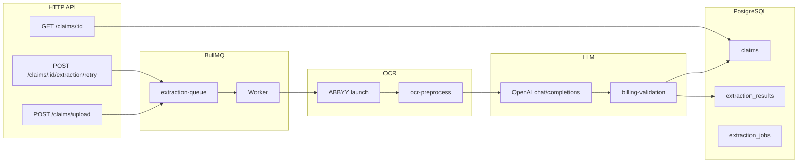
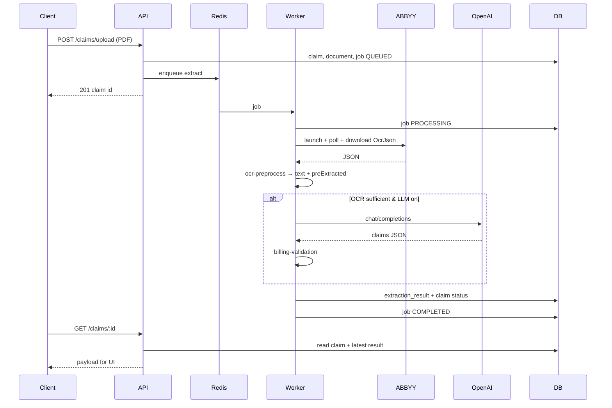

# Extraction pipeline: Upload → OCR → LLM → Result

Dokumen ini menjelaskan alur pemrosesan klaim asuransi dari upload dokumen hingga hasil terstruktur tersimpan di database dan ditampilkan di UI.

## Ringkasan



| Tahap | Teknologi | Output utama |
|-------|-----------|--------------|
| Upload | Express + Multer + local storage | `claims`, `claim_documents`, `extraction_jobs` (QUEUED) |
| OCR | ABBYY Vantage Public API | `OcrJson` → teks terfilter + `preExtractedFields` |
| Gate | `OCR_MIN_TEXT_CHARS` | Lanjut LLM atau skip |
| LLM | OpenAI (`gpt-4o-mini` default) | `{ "claims": [...] }` dengan traced fields |
| Validasi | `billing-validation.ts` | `validation.hasBillingMismatch` |
| Persist | Sequelize | `claims.extractionResult`, `extraction_results`, status claim |
| OCR credits | `ocr-credits.service.ts` | Debit 1 kredit per halaman saat ekstraksi sukses |

### OCR credits

- **Aturan:** 1 halaman = 1 OCR kredit (`creditsFromPageCount`, dari `ocrPageCount` ABBYY).
- **Debit:** Hanya saat job ekstraksi selesai (`COMPLETED`), idempotent per `extractionJobId` (ledger `ocr_credit_transactions`).
- **Cek saldo:** Sebelum upload/retry (min. 1 kredit) dan setelah OCR (sesuai jumlah halaman).
- **Organisasi:** Kolom `organizations.ocrCreditsRemaining`, `ocrMonthlyQuota`, `ocrCreditsUsedThisMonth`.
- **Dashboard:** `GET /api/reports/summary` → `creditUsage` (bukan lagi hardcoded).
- **Env:** `OCR_CREDITS_MONTHLY_QUOTA` (default 16000) untuk org baru / backfill.

---

## 1. Upload

### HTTP

```
POST /api/claims/upload
Content-Type: multipart/form-data
Field: document (PDF, JPEG, PNG)
```

Handler: `src/modules/claims/presentation/claims.routes.ts`  
Service: `src/modules/claims/application/claims.service.ts` → `uploadClaim()`

### Langkah

1. Validasi MIME: `application/pdf`, `image/jpeg`, `image/png`.
2. Buat record **Claim** (`status: Processing`).
3. Simpan file via `LocalStorageService` → `storage/uploads/<uuid>.<ext>`.
4. Buat **ClaimDocument** (`originalName`, `mimeType`, `storagePath`).
5. Cek **OCR credits** organisasi (min. 1); gagal → `402 INSUFFICIENT_OCR_CREDITS`.
6. Buat **ExtractionJob** (`status: QUEUED`).
7. `enqueueExtraction({ claimId, extractionJobId })` ke Redis queue `extraction-queue`.

### Retry upload (dokumen sama)

```
POST /api/claims/:claimId/extraction/retry
```

`ClaimsService.retryExtraction()` — job baru QUEUED, claim kembali `Processing`, `extractionResult` di-reset.

---

## 2. Queue worker (orchestrator)

File: `src/queue/extraction-queue.ts`

Worker BullMQ menjalankan job `extract` dengan payload:

```typescript
{ claimId: string; extractionJobId: string }
```

Urutan di worker:

1. `ExtractionJob` → `PROCESSING`
2. Ambil dokumen terbaru (`claim_documents`, `ORDER BY createdAt DESC`)
3. `extractTextFromDocument()` — OCR
4. `logOcrExtraction()` — log Winston + file opsional di `storage/logs/ocr/`
5. `isOcrTextSufficient()` — gate
6. `postProcessExtractionWithLlm()` — jika cukup teks & LLM enabled
7. `validateClaimsBilling()` — jika ada `claims[]`
8. Tulis `extraction_results` + update `claims.extractionResult` + status claim
9. `ExtractionJob` → `COMPLETED` atau `FAILED` (event `failed`)

Retry BullMQ: **3 attempts**, backoff exponential 3s.

---

## 3. OCR (ABBYY Vantage)

### Entry

`src/modules/extraction/application/document-text-extractor.ts`  
→ `src/modules/extraction/infrastructure/abbyy-vantage-client.ts`

### Alur API ABBYY

1. **Token** — `POST {ABBYY_BASE_URL}/auth2/connect/token` (client credentials).
2. **Launch** — `POST /api/publicapi/v1/transactions/launch?skillId=...`
   - Multipart: `Model` = string JSON `{"files":[{}]}`
   - `Files` = blob PDF/image + **nama file asli** (`originalName`)
3. **Poll** — `GET /transactions/{id}` sampai `status === Processed` (interval `ABBYY_POLL_INTERVAL_MS`, timeout `ABBYY_TRANSACTION_TIMEOUT_MS`).
4. **Download** — `GET /transactions/{id}/files/{fileId}/download` untuk setiap `resultFiles`. Skill OCR baru mengembalikan **dua** file: `type: "OcrJson"` dan `type: "Text"`.

### Konversi hasil → teks (dual-file)

`src/modules/extraction/application/vantage-result-to-text.ts`

Poll `Processed` sekarang sering mengembalikan dua `resultFiles`:

| `type` | Peran |
|--------|--------|
| `OcrJson` | Layout + bounding box `(l,t,r,b)` untuk `ocrPageLines` / PDF highlight |
| `Text` | Plain text siap pakai → **langsung ke LLM** tanpa reformat |

Alur di `abbyyResultsToOcrText()`:

1. **Keduanya ada** → `combineAbbyyTextAndLayout()`: teks LLM dari file **Text**; posisi dari **OcrJson** via `filterOcrJson()` (bukan `prepareForLLM()`).
2. **Hanya OcrJson** (skill lama) → `preprocessAbbyyOcrJson()` + `prepareForLLM()` seperti sebelumnya.
3. **Hanya Text** → plain text fallback; tanpa layout/regions.

Nomor halaman di layout mengikuti **indeks OcrJson** (`layout.pages[0]` → page `1`, …), bukan angka mentah dari marker Text `(Page 8 of 13)`.

### Preprocess OCR (`ocr-preprocess.ts`)

Tujuan: **tidak mengirim raw JSON ABBYY (~80k baris) ke LLM**.

| Fungsi | Peran |
|--------|------|
| `filterOcrJson()` | Parse ABBYY layout → per-page blocks dengan `region` (l,t,r,b); page = indeks layout 1-based |
| `combineAbbyyTextAndLayout()` | Dual-file: Text → LLM, OcrJson → `pages` untuk highlight |
| `splitAbbyyPlainTextByPage()` | Split file Text pada marker `(Page N of M)` → indeks urut 1, 2, 3… |
| `prepareForLLM()` | Fallback OcrJson-only: visual rows + cap `LLM_OCR_MAX_CHARS` |
| `preprocessAbbyyOcrJson()` | OcrJson-only entry point (memanggil `prepareForLLM`) |

Output ke worker (dual-file):

| Field | Keterangan |
|-------|------------|
| `text` / `filteredPlainText` | Isi file **Text** (normalisasi whitespace ringan) |
| `llmPrepared.pages` | Blocks + regions dari **OcrJson** |
| `ocrFiltered` | `true` jika layout OcrJson tersedia |
| `abbyyTransactionId` | ID transaksi Vantage |

### Gate OCR

`isOcrTextSufficient(text, filteredPlainText)` — panjang karakter (tanpa whitespace) dari **filtered plain text** ≥ `OCR_MIN_TEXT_CHARS` (default **80**).

Jika tidak cukup: LLM **tidak dipanggil**, `llmStatus: failed`, claim cenderung `Needs Attention`.

---

## 4. LLM post-process

File: `src/modules/extraction/application/llm-post-process.ts`  
Prompt: `src/modules/extraction/prompts/healthcare-claim-extraction.txt`  
Schema: `src/modules/extraction/domain/extraction-schema.ts`

### Aktif jika

- `ENABLE_LLM_POST_PROCESS=true`
- `OPENAI_API_KEY` terisi
- OCR cukup panjang (gate worker + double-check di `postProcessExtractionWithLlm`)

### Request OpenAI

- Endpoint: `{OPENAI_BASE_URL}/chat/completions`
- Model: `OPENAI_MODEL` (default `gpt-4o-mini`)
- `response_format: { type: "json_object" }`
- **System:** instruksi prompt (tanpa placeholder `{{RAW_OCR_TEXT}}`)
- **User:** `Raw OCR text:\n` + `extracted.text` (dipotong `LLM_OCR_MAX_CHARS`, default 24000)

### Parsing & retry

- `llm-json-parse.ts` — repair JSON, normalisasi ke `claims[]`
- Retry hingga `LLM_MAX_RETRIES + 1` untuk truncation, empty claims, invalid JSON
- `LLM_MAX_OUTPUT_TOKENS` (default 16384), timeout `LLM_REQUEST_TIMEOUT_MS`

### Kontrak output LLM

Root wajib:

```json
{
  "claims": [
    {
      "provider": { "hospital_name": { "value", "source_text", "page", "confidence" } },
      "patient": { "name": { ... }, "dob": { ... } },
      "billing": { "total_amount_read": { ... } },
      "encounter": { "admission_date": { ... }, "discharge_date": { ... } },
      "items": [ { "description", "amount", "source_text", "page", "confidence", ... } ],
      "tests": [ ... ]
    }
  ],
  "confidence": 0.85
}
```

- `value`: `"not_found"` jika tidak ada di OCR
- `source_text`: cuplikan **persis** dari OCR (max ~400 char saat normalize)
- `confidence`: 0–1

---

## 5. Validasi billing

`src/modules/extraction/application/billing-validation.ts`

Membandingkan per claim:

- `total_amount_read` vs `total_amount_calculated`
- Sum line items vs total

Toleransi: `BILLING_MISMATCH_TOLERANCE_PERCENT` (default 2%).  
Hasil: `validation.hasBillingMismatch` + pesan per claim index.

---

## 6. Persist & status claim

### Payload `extractionResult` (disimpan di `claims` + `extraction_results.payload`)

| Field | Sumber |
|-------|--------|
| `claims` | Output LLM |
| `structuredData` | `{ claims: [...] }` mirror |
| `summary` | `extraction-summary.ts` atau fallback parse teks |
| `rawText` / `ocrRawText` | `filteredPlainText` (bukan raw JSON) |
| `ocrCharCount`, `ocrSufficient`, `ocrFiltered`, `ocrPageCount` | OCR |
| `preExtractedFields` | Regex preprocess |
| `abbyyTransactionId`, `abbyySkillId` | ABBYY |
| `abbyyRawResults` | Preview 2KB per file (bukan full JSON) |
| `validation` | Billing |
| `llmStatus`, `llmError`, `llmAttempts`, `llmEnhanced` | LLM |
| `confidence` | LLM aggregate atau estimasi lokal |
| `schemaVersion` | `3` |
| `ocrPageLines` | Per page: `lines[]`, `rows[]`, `pairs[]`, `tables[]`, `linesFlat[]`, `regions[]` (tanpa words/chars mentah) |

### Status claim (`resolveClaimStatus`)

| Kondisi | Status |
|---------|--------|
| OCR insufficient | `Needs Attention` |
| LLM expected & failed | `Needs Attention` |
| Billing mismatch | `Needs Attention` |
| Confidence &lt; 0.65 | `Needs Attention` |
| Lainnya | `Extracted` |

Review manual:

```
PATCH /api/claims/:claimId/review
{ "status": "Reviewed" | "Needs Attention", "reviewedResult": { ... } }
```

---

## 7. Membaca hasil (API & UI)

```
GET /api/claims/:claimId
```

Response mencakup `claim`, `documents`, `latestJob`, `latestResult`.

Frontend: `/claims/[id]` — timeline, tab Overview/Fields/Line items/JSON/Debug, preview dokumen.

Status job: refresh manual lewat tombol **Refresh** di halaman claim detail (tanpa polling otomatis).

---

## Environment variables

| Variable | Default | Peran |
|----------|---------|-------|
| `REDIS_HOST`, `REDIS_PORT` | 127.0.0.1:6379 | BullMQ |
| `STORAGE_PATH` | `./storage` | Upload & logs |
| `ABBYY_BASE_URL` | vantage-au | Tenant ABBYY |
| `ABBYY_CLIENT_ID`, `ABBYY_CLIENT_SECRET` | — | Auth |
| `ABBYY_SKILL_ID` | — | OCR skill UUID (wajib set manual jika list API 403) |
| `ABBYY_POLL_INTERVAL_MS` | 2000 | Poll transaction |
| `ABBYY_TRANSACTION_TIMEOUT_MS` | 300000 | Timeout OCR |
| `OCR_MIN_TEXT_CHARS` | 80 | Gate LLM |
| `LLM_OCR_MAX_CHARS` | 24000 | Max teks ke GPT |
| `ENABLE_LLM_POST_PROCESS` | false | Aktifkan LLM |
| `OPENAI_API_KEY`, `OPENAI_MODEL` | — | LLM |
| `LLM_MAX_RETRIES` | 2 | Retry parse/HTTP |
| `LLM_MAX_OUTPUT_TOKENS` | 16384 | Max token keluaran |
| `LLM_REQUEST_TIMEOUT_MS` | 120000 | Timeout request |
| `BILLING_MISMATCH_TOLERANCE_PERCENT` | 2 | Validasi total |
| `LOG_OCR_TO_FILE` | true | Log OCR ke `storage/logs/ocr/` |

Lihat `src/config/env.ts` dan `.env.example`.

---

## Peta file kode

```
src/
├── queue/extraction-queue.ts          # Orchestrator worker
├── modules/
│   ├── claims/
│   │   ├── application/claims.service.ts
│   │   └── presentation/claims.routes.ts
│   └── extraction/
│       ├── application/
│       │   ├── document-text-extractor.ts
│       │   ├── vantage-result-to-text.ts
│       │   ├── ocr-preprocess.ts
│       │   ├── ocr-log.ts
│       │   ├── llm-post-process.ts
│       │   ├── llm-json-parse.ts
│       │   ├── billing-validation.ts
│       │   └── extraction-summary.ts
│       ├── domain/extraction-schema.ts
│       ├── infrastructure/abbyy-vantage-client.ts
│       └── prompts/healthcare-claim-extraction.txt
└── storage/local/local-storage.service.ts
```

---

## Troubleshooting

| Gejala | Penyebab umum | Cek |
|--------|---------------|-----|
| `ABBYY launch failed (403)` | API client tidak boleh skill | Vantage Admin → permissions + skill published |
| `ABBYY transaction Failed` + format not recognized | Multipart salah / PDF corrupt | Bandingkan dengan Postman; cek file di disk |
| `llmStatus: failed`, OCR OK | JSON invalid / empty claims / token limit | Log `llmError`, naikkan `LLM_MAX_OUTPUT_TOKENS` |
| `ocrSufficient: false` | Teks filtered &lt; 80 char | OCR gagal baca / dokumen kosong |
| `patient.name: not_found` | Label OCR tanpa nilai (form RS) | Bukan bug LLM — layout kwitansi; perlu heuristik multi-baris |
| Job FAILED, worker crash | Redis/ABBYY down | `extraction_jobs.error_message`, Winston logs |

---

## Diagram urutan (sequence)



---

## Perubahan arsitektur (vs OCR lokal)

- **pdf-parse / tesseract** dihapus — OCR hanya ABBYY Vantage.
- Raw `OcrJson` tidak dikirim ke LLM; gunakan `ocr-preprocess` + cap karakter.
- `preExtractedFields` adalah hint regex, bukan pengganti output LLM schema penuh.

### Verifikasi OCR pasca-LLM (`extraction-verify.ts`)

Setelah JSON LLM dinormalisasi, setiap field **divalidasi terhadap korpus OCR** (`filteredPlainText` + `ocrPageLines`):

- `value` harus dapat dibuktikan di `source_text` atau teks OCR (termasuk match digit untuk nominal).
- Nilai uang tanpa digit / hanya tanda baca → `not_found`.
- Field LLM yang gagal verifikasi diganti dari **pre-extracted** atau **layout pairs** jika terbukti di OCR.
- Line item / lab tanpa jejak di OCR dihapus.

Payload menyimpan `extractionVerification`: `{ fieldsChecked, fieldsRejected, fieldsRepairedFromOcr, rejectedPaths, ... }`.

### Trace & highlight dari OcrJson (`attach-ocr-block-regions.ts`)

Setelah verifikasi OCR, **`attachOcrBlockRegions`** (bukan text enrich) menempelkan `traces[]` + `region` ke setiap field:

- Query pencarian: **`value` LLM dulu**, `source_text` hanya jika pendek/relevan (menghindari match block salah dari baris panjang).
- Semua block OcrJson yang match (multi-page) → `discoverOcrBlocksForValue`.
- Line items / tests: `field_traces` per kolom + `traces` ringkasan dari description / test_name.

Jika `ocrPages` kosong (tanpa OcrJson), field tetap tanpa `region`.

**Catatan:** Akurasi 100% mutlak dari model saja tidak realistis; sistem ini menolak tebakan yang tidak ada di OCR daripada menampilkan nilai salah.

---

*Terakhir diselaraskan dengan codebase Claimora backend — pipeline upload → ABBYY → preprocess → OpenAI → persist.*
